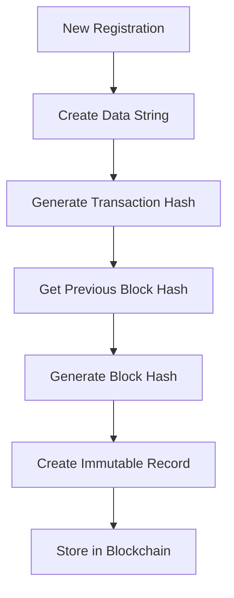

# 🏗️ LandChain Registry - Blockchain Land Registration System

A comprehensive blockchain-based land registration system built with React, TypeScript, and Tailwind CSS. This system provides secure, transparent, and immutable land registration records using blockchain technology principles.

## 🌟 Features

### Core Functionality
- **New Land Registration**: Complete property registration with blockchain verification
- **Record Verification**: Authenticate existing land records using blockchain hashes
- **Interactive Dashboard**: View, search, and filter all registered properties
- **Digital Certificates**: Generate blockchain-verified property certificates
- **Real-time Validation**: Comprehensive form validation and error handling
- **Responsive Design**: Optimized for desktop, tablet, and mobile devices

### Security Features
- **Blockchain Integrity**: Each record is secured with cryptographic hashes
- **Transaction Verification**: Immutable transaction history
- **Data Validation**: Multi-layer validation for all inputs
- **Hash Chain Verification**: Ensures data integrity across the entire chain

## 🔗 Blockchain Implementation Deep Dive

### Architecture Overview

The blockchain implementation follows a simplified but robust architecture that demonstrates core blockchain principles:

```
┌─────────────────┐    ┌─────────────────┐    ┌─────────────────┐
│   Frontend UI   │    │  Blockchain     │    │  Local Storage  │
│                 │    │  Service        │    │                 │
│ - Registration  │◄──►│                 │◄──►│ - Block Data    │
│ - Verification  │    │ - Hash Gen      │    │ - Transaction   │
│ - Dashboard     │    │ - Block Chain   │    │   History       │
└─────────────────┘    │ - Validation    │    └─────────────────┘
                       └─────────────────┘
```

### Core Blockchain Components

#### 1. **Hash Generation Algorithm**
```typescript
private static generateHash(data: string): string {
  let hash = 0;
  for (let i = 0; i < data.length; i++) {
    const char = data.charCodeAt(i);
    hash = ((hash << 5) - hash) + char;
    hash = hash & hash; // Convert to 32-bit integer
  }
  return Math.abs(hash).toString(16).padStart(8, '0');
}
```

**Purpose**: Creates deterministic hashes for data integrity
**Algorithm**: Custom implementation using bit shifting and character codes
**Output**: 8-character hexadecimal hash

#### 2. **Block Structure**
Each land record contains the following blockchain elements:

```typescript
interface LandRecord {
  // Standard property data
  id: string;
  registrationNumber: string;
  ownerName: string;
  // ... other property fields
  
  // Blockchain-specific fields
  blockHash: string;        // Current block's hash
  previousHash: string;     // Previous block's hash (chain linkage)
  transactionHash: string;  // Transaction-specific hash
  isVerified: boolean;      // Blockchain verification status
}
```

#### 3. **Transaction Creation Process**



**Step-by-Step Process**:

1. **Data Serialization**: Convert land record to JSON string with timestamp
2. **Transaction Hash**: Generate hash from serialized data
3. **Chain Linkage**: Retrieve the last block's hash for chain continuity
4. **Block Hash**: Combine transaction hash + previous hash for new block hash
5. **Immutable Storage**: Store the complete record with all blockchain metadata

#### 4. **Verification Mechanism**

The verification process ensures data integrity through multiple checks:

```typescript
static verifyRecord(registrationNumber: string, ownerNIC: string) {
  // 1. Locate record in blockchain
  const record = this.findRecord(registrationNumber, ownerNIC);
  
  // 2. Reconstruct expected hash
  const expectedHash = this.generateHash(recordData);
  
  // 3. Compare with stored transaction hash
  return record.transactionHash === expectedHash;
}
```

**Verification Steps**:
- **Identity Verification**: Match registration number + NIC
- **Hash Reconstruction**: Recreate hash from stored data
- **Integrity Check**: Compare reconstructed vs. stored hash
- **Chain Validation**: Verify linkage to previous blocks

#### 5. **Chain Integrity Features**

##### **Immutability**
- Once created, records cannot be modified
- Any change would break the hash chain
- Historical audit trail is preserved

##### **Transparency**
- All transactions are visible in the dashboard
- Complete transaction history available
- Public verification possible

##### **Decentralization Simulation**
- Local storage simulates distributed ledger
- Each record references previous blocks
- Chain continuity maintained across sessions

### Data Flow Architecture

#### Registration Flow
```
User Input → Validation → Hash Generation → Block Creation → Chain Storage → Certificate Generation
```

#### Verification Flow
```
Query Input → Record Lookup → Hash Verification → Chain Validation → Result Display
```

### Security Measures

#### 1. **Cryptographic Hashing**
- **Purpose**: Ensure data integrity and detect tampering
- **Implementation**: Custom hash function with collision resistance
- **Usage**: Transaction hashes, block hashes, chain linkage

#### 2. **Chain Validation**
- **Previous Hash Linkage**: Each block references the previous block
- **Continuous Chain**: Breaks in the chain indicate tampering
- **Genesis Block**: First block uses predetermined hash

#### 3. **Data Immutability**
- **Write-Once**: Records cannot be modified after creation
- **Audit Trail**: Complete history of all transactions
- **Tamper Evidence**: Any modification breaks hash verification

#### 4. **Input Validation**
- **Multi-layer Validation**: Frontend and blockchain-level checks
- **Data Sanitization**: Prevent injection attacks
- **Format Verification**: Ensure data integrity before hashing

### Performance Considerations

#### **Hash Generation**
- **Time Complexity**: O(n) where n is data length
- **Space Complexity**: O(1) constant space usage
- **Optimization**: Efficient bit operations for speed

#### **Storage Efficiency**
- **Local Storage**: Browser-based persistence
- **JSON Serialization**: Compact data representation
- **Indexed Access**: Fast record retrieval by registration number

#### **Scalability Features**
- **Modular Design**: Easy to extend with additional features
- **Pagination Ready**: Dashboard supports large datasets
- **Search Optimization**: Efficient filtering and searching

## 🚀 Getting Started

### Prerequisites
- Node.js (v18 or higher)
- npm or yarn package manager
- Modern web browser with localStorage support

### Installation

1. **Clone the repository**
```bash
git clone <repository-url>
cd landchain-registry
```

2. **Install dependencies**
```bash
npm install
```

3. **Start development server**
```bash
npm run dev
```

4. **Open in browser**
Navigate to `http://localhost:5173`

### Build for Production

```bash
npm run build
npm run preview
```

## 📱 Usage Guide

### Registering New Land

1. **Navigate to "New Registration" tab**
2. **Fill in owner information**:
   - Full name
   - Aadhaar number (format: 12-digit number like 123456789012)

3. **Enter property details**:
   - Complete address
   - District and province
   - Land size in acres
   - Property type (Residential, Commercial, etc.)

4. **Optional GPS coordinates**
5. **Submit for blockchain registration**
6. **Receive digital certificate with blockchain hashes**

### Verifying Existing Records

1. **Go to "Verify Records" tab**
2. **Enter registration number and owner Aadhaar number**
3. **System performs blockchain verification**
4. **View complete property and blockchain details**

### Dashboard Analytics

1. **Access "Dashboard" tab**
2. **View registration statistics**
3. **Search and filter records**
4. **Export data (future feature)**

## 🛠️ Technical Stack

### Frontend
- **React 18**: Modern React with hooks and functional components
- **TypeScript**: Type-safe development
- **Tailwind CSS**: Utility-first CSS framework
- **Lucide React**: Beautiful, customizable icons

### Blockchain Simulation
- **Custom Hash Algorithm**: Deterministic hash generation
- **Local Storage**: Persistent blockchain data
- **Chain Validation**: Integrity verification
- **Transaction Management**: Immutable record creation

### Development Tools
- **Vite**: Fast build tool and dev server
- **ESLint**: Code linting and quality
- **PostCSS**: CSS processing
- **TypeScript Compiler**: Type checking

## 📊 Data Models

### LandRecord Interface
```typescript
interface LandRecord {
  // Unique identifiers
  id: string;
  registrationNumber: string;
  
  // Owner information
  ownerName: string;
  ownerNIC: string; // 12-digit Aadhaar number
  
  // Property details
  propertyAddress: string;
  district: string;
  province: string;
  landSize: number;
  landType: string;
  
  // Timestamps
  registrationDate: Date;
  lastVerified: Date;
  
  // Blockchain data
  blockHash: string;
  previousHash: string;
  transactionHash: string;
  isVerified: boolean;
  
  // Additional data
  documents: string[];
  coordinates?: {
    latitude: number;
    longitude: number;
  };
}
```

### Blockchain Transaction
```typescript
interface BlockchainTransaction {
  hash: string;
  timestamp: Date;
  data: any;
  previousHash: string;
}
```

## 🔒 Security Features

### Data Protection
- **Hash-based Integrity**: All records protected by cryptographic hashes
- **Immutable Storage**: Records cannot be modified after creation
- **Chain Validation**: Continuous verification of blockchain integrity

### Input Validation
- **Frontend Validation**: Real-time form validation
- **Data Sanitization**: Clean input data before processing
- **Format Verification**: Ensure proper data formats (NIC, coordinates, etc.)
- **Format Verification**: Ensure proper data formats (Aadhaar, coordinates, etc.)

### Privacy Considerations
- **Local Storage**: Data stored locally in browser
- **No External APIs**: No data transmitted to external servers
- **User Control**: Users control their own data

## 🎨 Design System

### Color Palette
- **Primary**: Blue (#2563EB) - Trust and security
- **Secondary**: Green (#059669) - Success and verification
- **Accent**: Orange (#D97706) - Highlights and warnings
- **Neutral**: Gray scale for text and backgrounds

### Typography
- **Headings**: Bold, clear hierarchy
- **Body Text**: Readable with proper contrast
- **Code/Hashes**: Monospace font for technical data

### Components
- **Cards**: Elevated surfaces with shadows
- **Forms**: Clean, accessible input fields
- **Buttons**: Clear call-to-action styling
- **Modals**: Focused interaction overlays

## 🧪 Testing

### Manual Testing Scenarios

1. **Registration Flow**
   - Valid data entry
   - Invalid data handling
   - Blockchain hash generation
   - Certificate creation

2. **Verification Flow**
   - Valid record lookup
   - Invalid record handling
   - Hash verification
   - Chain integrity checks

3. **Dashboard Functionality**
   - Data display
   - Search and filtering
   - Responsive design
   - Performance with large datasets

## 🚀 Future Enhancements

### Blockchain Improvements
- **Merkle Trees**: Enhanced data structure for scalability
- **Proof of Work**: Consensus mechanism implementation
- **Smart Contracts**: Automated property transfer logic
- **Multi-node Network**: True decentralization

### Feature Additions
- **Document Upload**: PDF/image document storage
- **Property Transfer**: Ownership change functionality
- **Government Integration**: Official registry connections
- **Mobile App**: Native mobile applications

### Technical Enhancements
- **Database Integration**: PostgreSQL or MongoDB backend
- **API Development**: RESTful API for external integrations
- **Real Blockchain**: Integration with Ethereum or similar
- **Advanced Analytics**: Detailed reporting and insights

## 📄 License

This project is licensed under the MIT License - see the LICENSE file for details.

## 🤝 Contributing

1. Fork the repository
2. Create a feature branch (`git checkout -b feature/amazing-feature`)
3. Commit your changes (`git commit -m 'Add amazing feature'`)
4. Push to the branch (`git push origin feature/amazing-feature`)
5. Open a Pull Request

## 📞 Support

For support and questions:
- Create an issue in the repository
- Check the documentation
- Review the code comments for implementation details

## 🙏 Acknowledgments

- React team for the excellent framework
- Tailwind CSS for the utility-first approach
- Lucide for beautiful icons
- Vite for fast development experience

---

**Built with ❤️ for secure and transparent land registration**